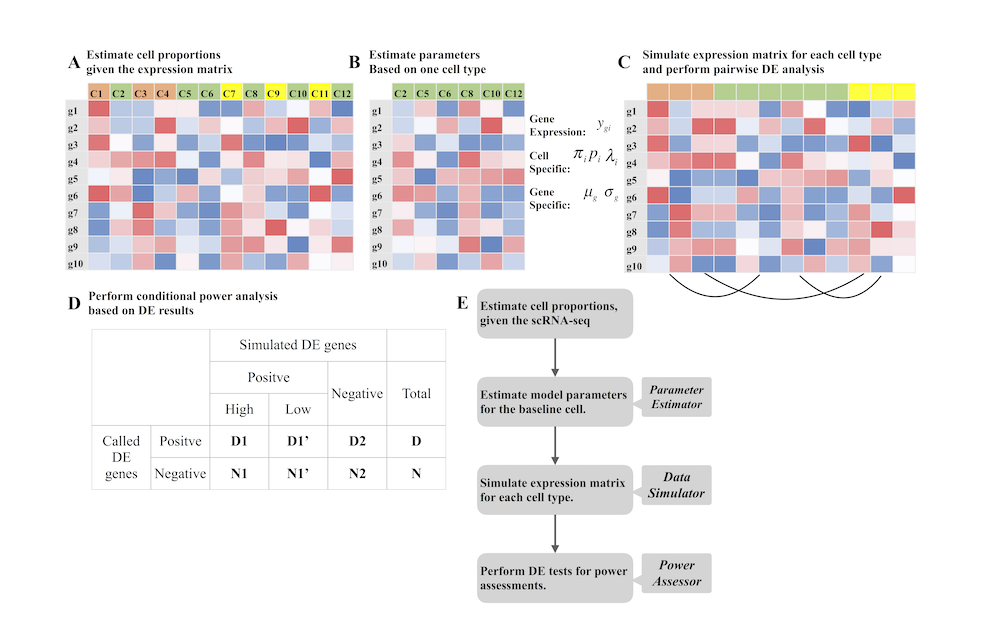

<center> <h4> POWSC: A computational tool for power evaluation and sample size estimation in scRNA-seq </h4> </center>

-------------------
**POWSC** is a R package designed for scRNA-seq with a wild range of usage. It can play three roles: **_parameter estimator_**, **_data simulator_**, and **_power assessor_**. As the parameter estimator, POWSC accurately captures the characterized parameters (`Fig.B`) for any specific cell type from a given real expression data (`Fig.A`). As the data simulator, POWSC generates sythetic data (`Fig.C`) based on a rigorous simulation mechanism incluidng zero expression values. As the power assessor, POWSC performs comprehensive power analysis and reports the stratified targeted powers (`Fig.D`) for two forms of DE genes. A schemetic overview of the aglorithm is shown in (`Fig.E`). All the copyrights are explaned by Kenong Su <kenong.su@emory.edu> and Dr. Wu's lab <http://www.haowulab.org>.


This tutorial introduces the basic functionalities of POWSC. Please use the <font color="blue">**vignette("POWSC")**</font> to review more detailed package vignette. It is worth noting that one might need pre-install dependent R packages such as MAST, SC2P, and SummarizedExperiment.

The corresponding paper can be found here:

---
references:
- POWSC
  title: Simulation, power evaluation and sample size recommendation for single-cell RNA-seq
  author:
  - Su
    Kenong
  URL: 'https://academic.oup.com/bioinformatics/advance-article-abstract/doi/10.1093/bioinformatics/btaa607/5866544'
  DOI: https://doi.org/10.1093/bioinformatics/btaa607
  publisher: Bioinformatics
---

### How to get help for POWSC
Any POWSC questions should be posted to the GitHub Issue section of POWSC homepage at https://github.com/suke18/POWSC/issues.


### 1. Software Installation
```
library(devtools)
install_github("suke18/POWSC", build_vignettes = T, dependencies = T)
R CMD INSTALL POWSC_0.1.0.tar.gz # Alternatively, use this command line in the terminal.
```

### 2. Code Snippets
**(1). parameter estimation for one cell type case**
```r
library(POWSC)
data("es_mef_sce")
sce = es_mef_sce[, colData(es_mef_sce)$cellTypes == "fibro"]
est_Paras = Est2Phase(sce)
```

**(2). the first scenairo of two-group comparison**
```r
sim_size = c(100, 400, 1000) # A numeric vector
pow_rslt = runPOWSC(sim_size = sim_size, est_Paras = est_Paras,per_DE=0.05, DE_Method = "MAST", Cell_Type = "PW") # Note, using our previous developed tool SC2P is faster.
plot_POWSC(pow_rslt, Form="II", Cell_Type = "PW") # Alternatively, we can use Form="I"
summary_POWSC(pow_rslt, Form="II", Cell_Type = "PW")
```
**(3). the second scenairo of multi-group comparisons**.
The sample data can be found here: https://www.dropbox.com/s/55zdktqfqiwfs3l/GSE67835.RData?dl=0.
```r
sim_size = 1000
cell_per = c(0.2, 0.3, 0.5)
load("pathto/GSE67835.RData") #data("GSE67835")
col = colData(sce)
exprs = assays(sce)$counts
(tb = table(colData(sce)$Patients, colData(sce)$cellTypes))
# use AB_S7 patient as example and take three cell types: astrocytes hybrid and neurons
estParas_set = NULL
celltypes = c("oligodendrocytes", "hybrid", "neurons")
for (cp in celltypes){
    print(cp)
    ix = intersect(grep(cp, col$cellTypes), grep("AB_S7", col$Patients))
    tmp_mat = exprs[, ix]
    tmp_paras = Est2Phase(tmp_mat)
    estParas_set[[cp]] = tmp_paras
}
pow_rslt = runPOWSC(sim_size = sim_size, est_Paras = estParas_set,per_DE=0.05, DE_Method = "MAST",multi_Prob = cell_per, Cell_Type = "Multi")
plot_POWSC(pow_rslt, Form="I", Cell_Type = "Multi")
summary_POWSC(pow_rslt, Form="II", Cell_Type = "Multi")
```
